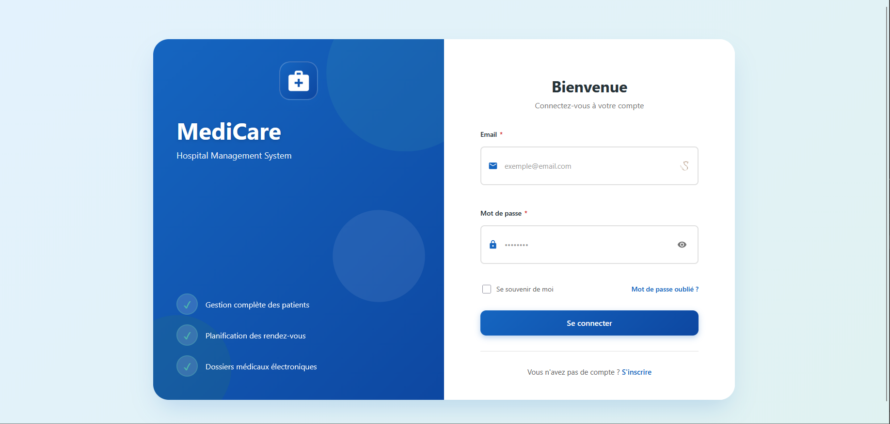
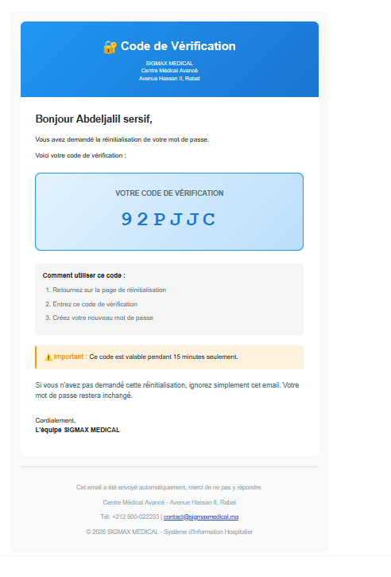
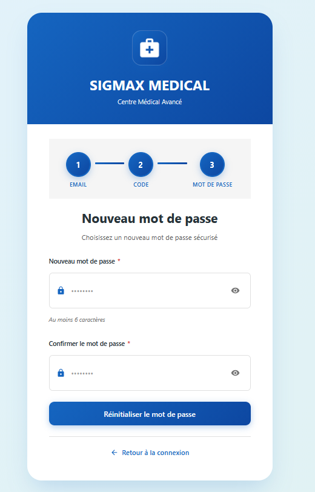
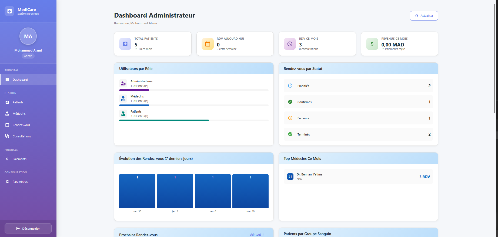
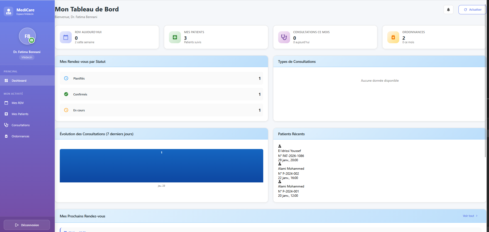
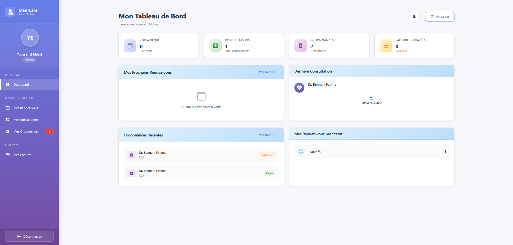
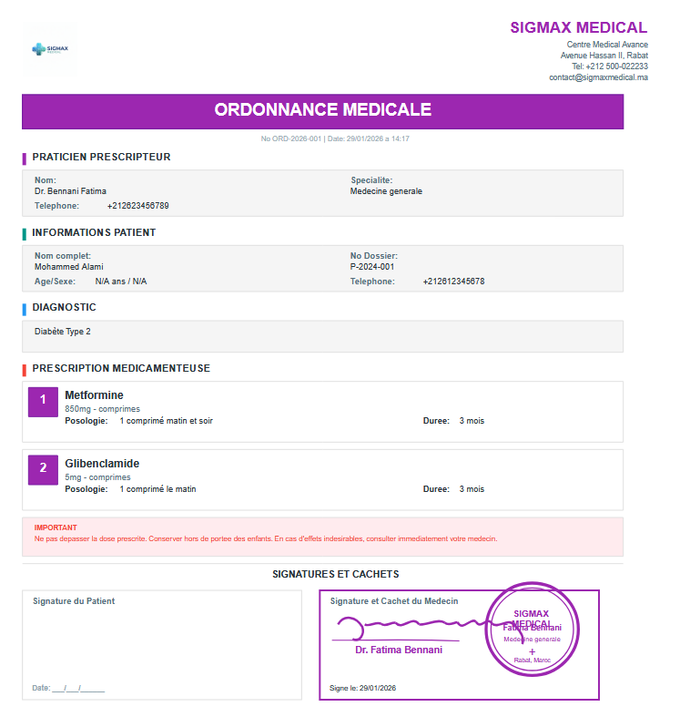
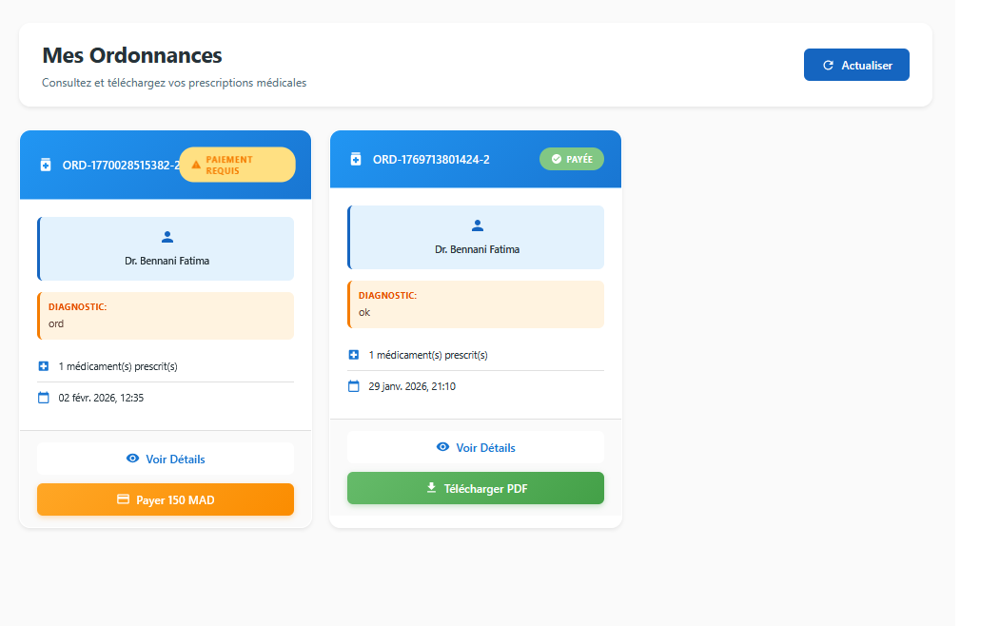
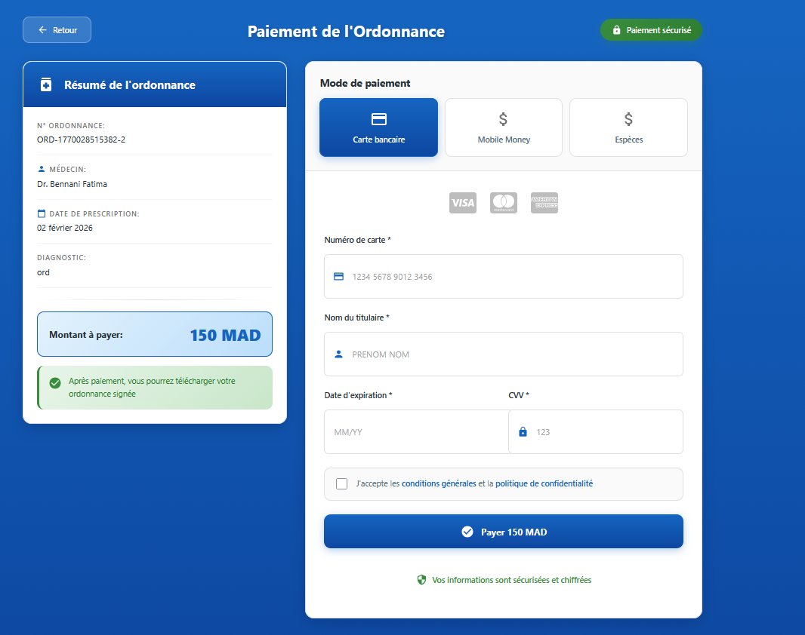
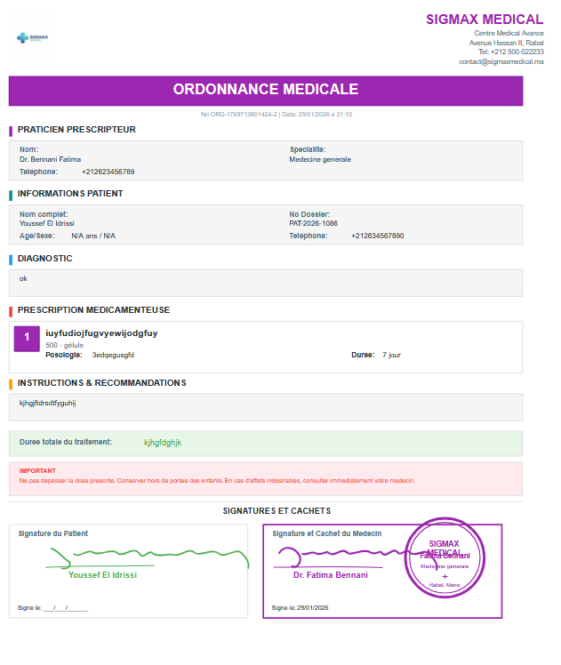

# 🏥 Hospital Management System

A comprehensive web-based Hospital Information System designed to modernize patient management, consultations, medical records, and billing operations for private clinics and healthcare facilities.

[](https://reactjs.org/)
[](https://nodejs.org/)
[](https://expressjs.com/)
[](https://www.mysql.com/)
[](https://jwt.io/)

## 📋 Table of Contents

- [Features](#-features)
- [Tech Stack](#-tech-stack)
- [Project Architecture](#-project-architecture)
- [Prerequisites](#-prerequisites)
- [Installation](#-installation)
- [Configuration](#-configuration)
- [Running the Application](#-running-the-application)
- [Test Accounts](#-test-accounts)
- [API Documentation](#-api-documentation)
- [Screenshots](#-screenshots)
- [Contributing](#-contributing)
- [License](#-license)

## ✨ Features

### 👥 Patient Management
- ✅ Complete CRUD operations for patient records
- ✅ Advanced search and filtering capabilities
- ✅ Medical history tracking
- ✅ Patient profile management with photo upload

### 📅 Appointment Scheduling
- ✅ Create, modify, and cancel appointments
- ✅ Real-time appointment status tracking
- ✅ Conflict detection and prevention
- ✅ Email notifications for appointments
- ✅ PDF appointment confirmation generation

### 🩺 Consultation Management
- ✅ Record diagnoses, prescriptions, and observations
- ✅ Link consultations with appointments and patients
- ✅ Digital prescription generation
- ✅ Consultation history tracking

### 📄 Electronic Medical Records (EMR)
- ✅ Centralized patient data storage
- ✅ Role-based secure access control
- ✅ Comprehensive consultation history
- ✅ Medical document management

### 💰 Billing & Invoicing
- ✅ Automatic invoice generation
- ✅ Payment tracking and history
- ✅ Multiple payment methods support
- ✅ Financial reports and analytics

### 👨‍⚕️ User & Role Management
- ✅ JWT-based authentication system
- ✅ Role-based access control (RBAC)
- ✅ Support for multiple user roles:
  - **Admin**: Full system access
  - **Doctor**: Patient and consultation management
  - **Nurse**: Limited patient care access
  - **Receptionist**: Appointment and billing management
  - **Patient**: Personal health record access

### 📊 Dashboard & Analytics
- ✅ Real-time statistics and KPIs
- ✅ Role-specific dashboards
- ✅ Visual data representation
- ✅ Quick access to important metrics

### 🔐 Security & Compliance
- ✅ Secure JWT authentication
- ✅ Password encryption (bcrypt)
- ✅ Audit logging for all critical actions
- ✅ GDPR-compliant data handling
- ✅ Session management

### 🔔 Notifications
- ✅ Real-time notifications system
- ✅ Email notifications for appointments
- ✅ Status update alerts

## 🛠️ Tech Stack

### Frontend
- **React.js** - UI library
- **React Router** - Navigation
- **Axios** - HTTP client
- **CSS3** - Styling
- **Context API** - State management

### Backend
- **Node.js** - Runtime environment
- **Express.js** - Web framework
- **MySQL** - Relational database
- **JWT** - Authentication
- **Bcrypt** - Password hashing
- **Nodemailer** - Email service
- **Multer** - File upload handling
- **PDFKit** - PDF generation

## 📁 Project Architecture

```
hospital-management-system/
│
├── backend/
│   ├── config/              # Configuration files
│   │   ├── auth.js          # JWT configuration
│   │   ├── database.js      # MySQL connection
│   │   ├── email.js         # Email service config
│   │   └── upload.js        # File upload config
│   │
│   ├── controllers/         # Business logic
│   │   ├── authController.js
│   │   ├── patientController.js
│   │   ├── appointmentController.js
│   │   ├── consultationController.js
│   │   ├── billingController.js
│   │   ├── prescriptionController.js
│   │   ├── dashboardController.js
│   │   └── ...
│   │
│   ├── models/              # Database models
│   │   ├── User.js
│   │   ├── Patient.js
│   │   ├── Appointment.js
│   │   ├── Consultation.js
│   │   ├── Invoice.js
│   │   ├── Prescription.js
│   │   ├── MedicalRecord.js
│   │   └── AuditLog.js
│   │
│   ├── routes/              # API endpoints
│   │   ├── authRoutes.js
│   │   ├── patientRoutes.js
│   │   ├── appointmentRoutes.js
│   │   ├── consultationRoutes.js
│   │   └── ...
│   │
│   ├── middlewares/         # Custom middlewares
│   │   ├── authMiddleware.js
│   │   ├── roleMiddleware.js
│   │   └── uploadMiddleware.js
│   │
│   ├── utils/               # Utility functions
│   │   ├── emailService.js
│   │   ├── pdfGenerator.js
│   │   ├── validation.js
│   │   └── helpers.js
│   │
│   ├── uploads/             # File storage
│   │   ├── profiles/
│   │   ├── documents/
│   │   ├── prescriptions/
│   │   └── pdfs/
│   │
│   ├── .env                 # Environment variables
│   ├── package.json
│   └── server.js            # Entry point
│
└── frontend/
    ├── public/
    │   ├── index.html
    │   └── ...
    │
    ├── src/
    │   ├── components/      # Reusable components
    │   │   ├── Layout.js
    │   │   ├── Button.js
    │   │   ├── Input.js
    │   │   ├── Modal.js
    │   │   ├── Table.js
    │   │   └── Loader.js
    │   │
    │   ├── pages/           # Page components
    │   │   ├── Login.js
    │   │   ├── Register.js
    │   │   ├── AdminDashboard.js
    │   │   ├── DoctorDashboard.js
    │   │   ├── PatientDashboard.js
    │   │   ├── Patients.js
    │   │   ├── Appointments.js
    │   │   ├── Consultations.js
    │   │   ├── Billing.js
    │   │   └── ...
    │   │
    │   ├── services/        # API service layer
    │   │   ├── api.js
    │   │   ├── authService.js
    │   │   ├── patientService.js
    │   │   ├── appointmentService.js
    │   │   └── ...
    │   │
    │   ├── context/         # React Context
    │   │   └── AuthContext.js
    │   │
    │   ├── hooks/           # Custom hooks
    │   │   └── useAuth.js
    │   │
    │   ├── styles/          # Global styles
    │   │   ├── global.css
    │   │   └── variables.css
    │   │
    │   ├── App.js
    │   └── index.js
    │
    ├── package.json
    └── README.md
```

## 📋 Prerequisites

Before you begin, ensure you have the following installed:

- **Node.js** (v16.0 or higher) - [Download](https://nodejs.org/)
- **npm** (v7.0 or higher) - Comes with Node.js
- **MySQL** (v8.0 or higher) - [Download](https://dev.mysql.com/downloads/mysql/)
- **XAMPP** or **WAMP** (for MySQL server) - [Download XAMPP](https://www.apachefriends.org/)
- **Git** (optional, for cloning) - [Download](https://git-scm.com/)

## 🚀 Installation

### 1️⃣ Clone the Repository

```bash
git clone https://github.com/SersifAbdeljalil/hospital_management.git
cd hospital_management
```

### 2️⃣ Database Setup

1. **Start XAMPP/WAMP and launch MySQL/phpMyAdmin**

2. **Create the database:**
   - Open phpMyAdmin in your browser (usually `http://localhost/phpmyadmin`)
   - Click on "New" to create a new database
   - Name it: `hospital_management`
   - Collation: `utf8mb4_general_ci`
   - Click "Create"

3. **Import the database structure:**
   - Select the `hospital_management` database
   - Click on the "Import" tab
   - Click "Choose File" and select the `database.sql` file from the project root
   - Click "Go" to import the tables and initial data

### 3️⃣ Backend Setup

```bash
# Navigate to backend directory
cd backend

# Install dependencies
npm install

# Create .env file
# Copy the .env.example to .env or create a new .env file
```

**Configure the `.env` file:**

```env
# Server Configuration
PORT=5000
NODE_ENV=development

# Database Configuration
DB_HOST=localhost
DB_USER=root
DB_PASSWORD=
DB_NAME=hospital_management
DB_PORT=3306

# JWT Configuration
JWT_SECRET=your_super_secret_jwt_key_here_change_this_in_production
JWT_EXPIRE=7d

# Email Configuration (Optional - for email notifications)
EMAIL_HOST=smtp.gmail.com
EMAIL_PORT=587
EMAIL_USER=your_email@gmail.com
EMAIL_PASSWORD=your_app_password
EMAIL_FROM=noreply@hospital.com

# File Upload Configuration
MAX_FILE_SIZE=5242880
UPLOAD_PATH=./uploads
```

### 4️⃣ Frontend Setup

```bash
# Open a new terminal and navigate to frontend directory
cd frontend

# Install dependencies
npm install
```

## ⚙️ Configuration

### Backend Configuration

The backend uses environment variables for configuration. Make sure to:

1. Update the database credentials in `.env` to match your MySQL setup
2. Change the `JWT_SECRET` to a strong, random string
3. Configure email settings if you want to enable email notifications

### Frontend Configuration

Update the API base URL in `src/services/api.js` if needed:

```javascript
const API_BASE_URL = 'http://localhost:5000/api';
```

## ▶️ Running the Application

### Start the Backend Server

```bash
# From the backend directory
cd backend
node server.js
```

**Expected output:**
```
[dotenv@17.2.3] injecting env (16) from .env
(-_-)Connexion à MySQL réussie!
(*__*)Base de données: hospital_management
=================================
- Serveur démarré sur le port 5000
- Mode: development
- URL: http://localhost:5000
=================================
 Serveur email prêt à envoyer des messages
```

### Start the Frontend Application

```bash
# Open a new terminal
# From the frontend directory
cd frontend
npm start
```

The application will automatically open in your browser at `http://localhost:3000`

## 🔑 Test Accounts

Use these pre-configured accounts to test different user roles:

### 👨‍💼 Administrator
- **Email:** `admin@hospital.com`
- **Password:** `Admin@123`
- **Access:** Full system access, user management, system settings

### 👨‍⚕️ Doctor
- **Email:** `docteur@hospital.com`
- **Password:** `Doctor@123`
- **Access:** Patient management, consultations, prescriptions, appointments

### 🧑‍⚕️ Patient
- **Email:** `patient@hospital.com`
- **Password:** `Patient@123`
- **Access:** Personal health records, appointments, prescriptions

> ⚠️ **Security Note:** Change these default passwords after first login in a production environment.

## 📚 API Documentation

### Authentication Endpoints

```
POST   /api/auth/login          # User login
POST   /api/auth/register       # User registration
POST   /api/auth/logout         # User logout
POST   /api/auth/forgot-password # Password reset request
POST   /api/auth/reset-password  # Reset password
GET    /api/auth/me             # Get current user info
```

### Patient Endpoints

```
GET    /api/patients            # Get all patients
GET    /api/patients/:id        # Get patient by ID
POST   /api/patients            # Create new patient
PUT    /api/patients/:id        # Update patient
DELETE /api/patients/:id        # Delete patient
GET    /api/patients/:id/history # Get medical history
```

### Appointment Endpoints

```
GET    /api/appointments         # Get all appointments
GET    /api/appointments/:id     # Get appointment by ID
POST   /api/appointments         # Create appointment
PUT    /api/appointments/:id     # Update appointment
DELETE /api/appointments/:id     # Cancel appointment
GET    /api/appointments/doctor/:doctorId # Get doctor's appointments
POST   /api/appointments/:id/pdf # Generate appointment PDF
```

### Consultation Endpoints

```
GET    /api/consultations        # Get all consultations
GET    /api/consultations/:id    # Get consultation by ID
POST   /api/consultations        # Create consultation
PUT    /api/consultations/:id    # Update consultation
DELETE /api/consultations/:id    # Delete consultation
```

### Billing Endpoints

```
GET    /api/billing/invoices     # Get all invoices
GET    /api/billing/invoices/:id # Get invoice by ID
POST   /api/billing/invoices     # Create invoice
PUT    /api/billing/invoices/:id # Update invoice
POST   /api/billing/pay/:id      # Process payment
```

### Dashboard Endpoints

```
GET    /api/dashboard/stats      # Get dashboard statistics
GET    /api/dashboard/admin      # Admin dashboard data
GET    /api/dashboard/doctor     # Doctor dashboard data
GET    /api/dashboard/patient    # Patient dashboard data
```

## 📸 Screenshots

### 🔐 Authentication
<table>
  <tr>
    <td><br/><b>Login Page</b></td>
    <td><br/><b>Forgot Password - Step 1</b></td>
  </tr>
  <tr>
    <td><br/><b>Forgot Password - Step 2</b></td>
    <td><br/><b>Forgot Password - Step 3</b></td>
  </tr>
</table>

### 📊 Dashboards
<table>
  <tr>
    <td><br/><b>Admin Dashboard</b></td>
    <td><br/><b>Doctor Dashboard</b></td>
  </tr>
  <tr>
    <td colspan="2" align="center"><br/><b>Patient Dashboard</b></td>
  </tr>
</table>

### 💊 Prescriptions & Billing
<table>
  <tr>
    <td><br/><b>Doctor Prescription Creation</b></td>
    <td><br/><b>Patient Prescriptions List</b></td>
  </tr>
  <tr>
    <td><br/><b>Prescription Payment</b></td>
    <td><br/><b>Payment Confirmation</b></td>
  </tr>
</table>

> **Note:** These screenshots showcase core features. Explore the application to discover many more functionalities!

## 🤝 Contributing

Contributions are welcome! Please follow these steps:

1. Fork the repository
2. Create a new branch (`git checkout -b feature/amazing-feature`)
3. Commit your changes (`git commit -m 'Add some amazing feature'`)
4. Push to the branch (`git push origin feature/amazing-feature`)
5. Open a Pull Request

## 💡 Additional Features

This Hospital Management System includes many more features beyond what's documented here! To explore all functionalities:

1. **Install the project** following the setup instructions above
2. **Test different user roles** with the provided test accounts
3. **Explore the dashboards** - each role has unique features and capabilities
4. **Try out the workflows** - from patient registration to billing

### 🔍 What to Explore:
- ✅ Advanced search and filtering across all modules
- ✅ Real-time notifications system
- ✅ Comprehensive audit logging
- ✅ PDF generation for appointments and prescriptions
- ✅ Email notification system
- ✅ File upload management (patient photos, medical documents)
- ✅ Multi-role access control and permissions
- ✅ And much more!

### 📞 Questions or Suggestions?

**Don't hesitate to contact me!** I welcome:
- ❓ Questions about the project
- 💡 Feature suggestions and improvements
- 🐛 Bug reports
- 🤝 Collaboration opportunities

**Feel free to reach out:**
- 📧 Email: abdosarsif28@gmail.com
- 💼 LinkedIn: [Sersif Abdeljalil](https://linkedin.com/in/sersif-abdeljalil)
- 🐙 GitHub: [@SersifAbdeljalil](https://github.com/SersifAbdeljalil)

> **Thank you for your interest in this project! Your feedback and contributions are greatly appreciated.** 🙏

## 📄 License

This project is licensed under the MIT License - see the [LICENSE](LICENSE) file for details.

## 👨‍💻 Author

**Sersif Abdeljalil**
- GitHub: [@SersifAbdeljalil](https://github.com/SersifAbdeljalil)
- Email: abdosarsif28@gmail.com
- LinkedIn: [Sersif Abdeljalil](https://linkedin.com/in/sersif-abdeljalil)

## 🙏 Acknowledgments

- Thanks to all contributors who have helped this project
- Inspired by modern healthcare management systems
- Built with ❤️ for improving healthcare operations

---

⭐ **If you find this project useful, please consider giving it a star!** ⭐